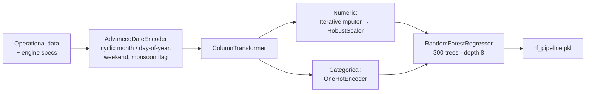

# ⛏️ Fuel Consumption Prediction for Heavy Mining Trucks


> A production-style ML pipeline that predicts **ton-kilometre fuel consumption (L / km / t)** of heavy haul trucks in an open-pit coal mine — combining operational data with **engine & vehicle specifications** and **physics-informed features**.

| Model | Train R² | **Test R²** | Test RMSE | CV R² (mean ± std) |
|---|---|---|---|---|
| Ridge (baseline) | 0.859 | 0.770 | 0.0087 | 0.835 ± 0.058 |
| **Random Forest** | 0.962 | **0.897** | **0.0058** | **0.884 ± 0.054** |
| XGBoost | 0.986 | 0.834 | 0.0074 | 0.886 ± 0.053 |
| **Production RF pipeline** (end-to-end `sklearn.Pipeline`) | — | **0.873** | — | 0.875 ± 0.065 |

---

## 📌 Why It Matters

Fuel is one of the largest operating costs of a mining fleet. Accurate fuel-per-tonne-km prediction enables:

- **Fleet cost forecasting** and budgeting by season,
- **Vehicle selection** for a given haul profile (payload, grade, road quality),
- Spotting **inefficient trucks or routes** early.

*Illustration:* for 50 trucks burning ~300,000 L/year each at ₹90/L (≈ ₹1.35 billion/year), a **3% efficiency gain is worth ≈ ₹40 million a year**.

## 🗂️ Data

**Source:** Figshare — *A Dataset for Fuel Consumption Prediction in Driverless Mining Trucks Using Deep Siamese Transformer Networks* (**292 operational records**).

| Group | Features |
|---|---|
| Operational | mileage, fuelling quantity, shift |
| Terrain | road quality, **raise-height difference**, working flat width |
| Environment | average temperature, wind speed, precipitation |
| Temporal | date → seasonality |

**Domain augmentation** — each truck model was enriched with engine & vehicle specs so the model learns *physics*, not truck IDs:

| Vehicle | Engine | Power (HP) | Displacement (L) | Kerb weight (kg) | Payload (kg) |
|---|---|---|---|---|---|
| RTH136 | YCK16775-T300 | 764 | 15.93 | 48,000 | 100,000 |
| MT96 | WP13G530E310 | 523 | 12.54 | 33,000 | 65,000 |
| SKT105E | WP13G530E310 | 523 | 12.54 | 38,000 | 70,000 |

## 🏗️ Pipeline



- **Custom transformer** `AdvancedDateEncoder` – sine/cosine encodings of month and day-of-year (so December and January are "close"), weekend flag and an Indian **monsoon-season** flag.
- **IterativeImputer** – model-based imputation for missing mileage / fuelling values.
- **RobustScaler** – resistant to the outliers common in field data.
- Everything lives in **one `sklearn.Pipeline`** → no train/serve skew, one `.pkl` to deploy.

## 📈 Results & Interpretation

- **Random Forest generalises best** (test R² 0.90, smallest train–test gap). XGBoost fits training data almost perfectly but drops more on test data → mild over-fitting on 292 samples. Ridge under-fits the non-linear interactions.
- **Most influential features:** raise-height difference, payload capacity, engine power, vehicle weight, road quality and ambient temperature.

### Physics check ✅

The important features match first principles of haul-truck energy use:

- **Grade resistance** $F_{grade} = m g \sin\theta$ → *raise-height difference* is a proxy for $\theta$.
- **Engine load** — fuel rate ∝ brake power / thermal efficiency → payload, vehicle weight and power matter.
- **Aerodynamic drag** $F_d = \tfrac{1}{2}\rho C_d A v^2$ and air density → wind and temperature matter.

So the model is learning physically meaningful relationships, not noise.

## 🚀 How to Run

```bash
git clone https://github.com/AnishRane-cox/Mining-and-Heavy-Equipment.git
cd Mining-and-Heavy-Equipment
pip install -r requirment.txt xgboost openpyxl jupyter
jupyter notebook ML/notebooks/Fuel_Consumption_Predictions_Experiment.ipynb
```

- `ML/notebooks/Fuel_Consumption_Predictions_Experiment.ipynb` — EDA, feature engineering, model comparison.
- `ML/notebooks/Pipeline_experiemtent.ipynb` — builds, validates and saves the production pipeline.
- `ML/models/rf_pipeline.pkl` — trained pipeline, load with `joblib.load(...)` and call `.predict(df)`.

## 📁 Repository Structure

```
ML/
├── data/Heavy Machinenary DataBase.xlsx   # Operational data + engine specs
├── notebooks/                             # Experiments & pipeline development
├── src/                                   # pipeline / train / predict modules
└── models/rf_pipeline.pkl                 # Trained model
requirment.txt
```

## ⚠️ Limitations

- Small dataset (292 records, 3 truck models, one mine site).
- No high-frequency RPM / torque telemetry or BSFC maps.
- Random train/test split — time-series cross-validation would be stricter.

## 🔭 Roadmap

- Hybrid **physics + ML** model using BSFC maps and tractive-effort calculations.
- SHAP explanations per prediction.
- FastAPI endpoint + telematics integration for real-time fleet dashboards.
- Expand to multiple mine sites and engine families.

---

## 👤 Author

**Anish Rane** — Data & AI Engineer · MSc Machine Learning & AI (LJMU) · Mechanical Engineer

[](https://anishrane-cox.github.io/Portfolio/)
[](https://www.linkedin.com/in/anish-rane/)
[](https://github.com/AnishRane-cox)

⭐ If you found this useful, consider starring the repo.
